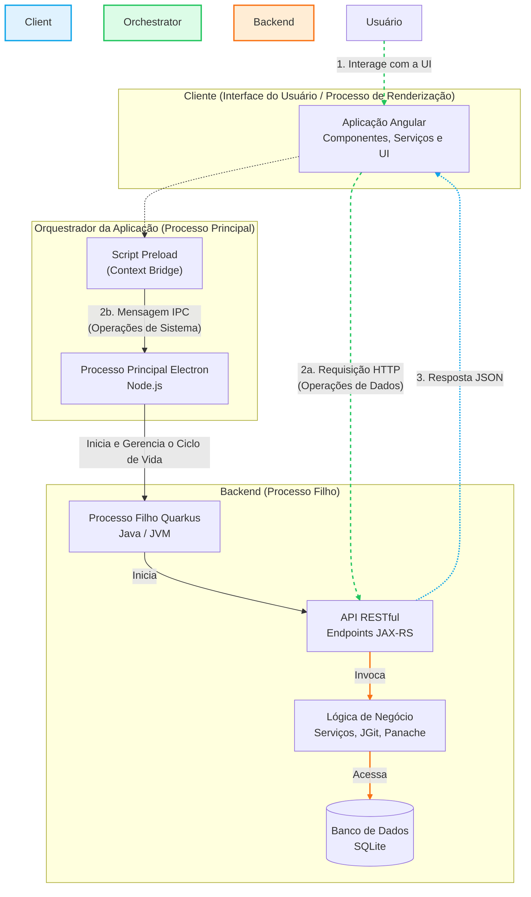

 # 🦊 Grep RTB

 > **Seu buscador de repositórios, rápido e estiloso!**

 ---

 ## 🚀 Como rodar o Grep RTB

 1. **Clone o repositório** (se ainda não fez isso):
	 ```sh
	 git clone <url-do-repo>
	 cd electron-grep-rtb
	 ```

 2. **Instale as dependências:**
	 ```sh
	 npm install
	 ```

 3. **Inicie o app:**
	 ```sh
	 npm run electron
	 ```

 ---

 ## 💡 Dicas
 - Certifique-se de ter o [Node.js](https://nodejs.org/) instalado.
 - O comando `npm run electron` vai abrir o Grep RTB em modo desktop, com toda a experiência visual pensada para você.
 - Personalize o app do seu jeito! O código está em `src/`.

 ---

 ## 📁 Estrutura principal
 ```
 public/           # Arquivos estáticos
 src/              # Código-fonte principal
	app/            # Componentes e configs do app
	util/           # Utilitários e ícones
 main.js           # Entrada Electron
 preload.js        # Preload Electron
 ```

 ---

 ## 🦊 Sobre
 O **Grep RTB** foi criado para facilitar sua vida na busca e visualização de repositórios, com uma interface moderna e intuitiva.

 ---

 Feito com 💜 por Kaio Valls
 

